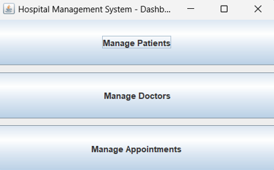
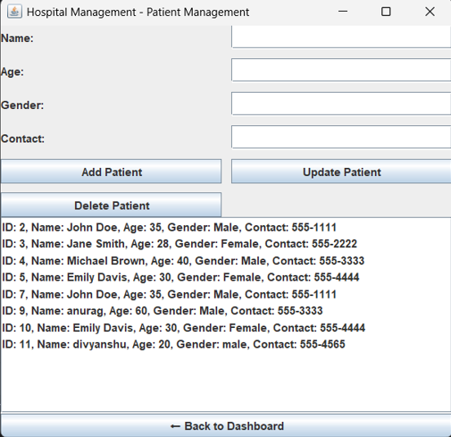
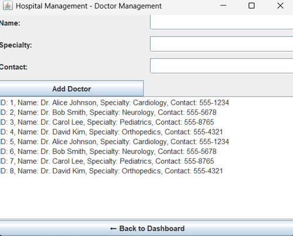
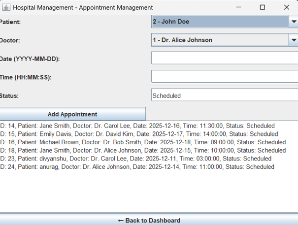

# Hospital Management System

This Java Swing application is a simple Hospital Management System built as part of training at Anudip Foundation. It allows managing Patients, Doctors, and Appointments with basic CRUD operations connected to a MySQL database.

---

## Features

* Manage Patients: Add, update, delete patients
* Manage Doctors: Add new doctors, view existing doctors
* Manage Appointments: Schedule appointments between patients and doctors
* Simple user interface using Java Swing
* Data persistence via MySQL database

---

## Technologies Used

* Java 24
* Java Swing (GUI)
* MySQL
* JDBC for database connectivity

---

## Project Structure

```
HospitalManagementSystem/
│
├── src/
|   |
│   ├── dao/
│   │    ├── PatientData.java
│   │    ├── DoctorData.java
│   │    ├── AppointmentData.java
│   │
│   ├── database/
│   │    └── DatabaseConnection.java
|   |
│   ├── ui/
│   │    ├── Dashboard.java
│   │    ├── PatientForm.java
│   │    ├── DoctorForm.java
│   │    ├── AppointmentForm.java
│   │
│
├── sql/
│    └── hospital_db_setup.sql
│
├── README.md
├── .gitignore
└── (other project files like .idea/, pom.xml if maven, etc.)

```

---

## Setup Instructions

1. **Clone the repository**

   ```
   git clone https://github.com/Kamal-Kant11/Anudip-Training.git

   ```

2. **Setup MySQL Database**

   * Run the SQL scripts located in the `sql/` folder to create the database schema and insert sample data.
   * Update the database connection credentials in `database/DatabaseConnection.java` if needed.

3. **Build and Run the Application**

   * Open the project in your preferred IDE (IntelliJ IDEA recommended).
   * Compile and run the Java Swing application. 
   Your starting point is the Dashboard.java file in the ui package.

   * Run Dashboard.java directly (it has a main method).

   * From Dashboard, you can navigate to Patient, Doctor, or Appointment forms.

   * All forms internally use DAO classes to read/write data from/to the database.
   * The main dashboard will open to navigate between Patients, Doctors, and Appointments.

---
## Screenshots

### DashBoard

### Patient Form

### Doctor Form

### Appointment Form



---

## Contributions

This project is primarily for training purposes. Contributions are welcome to improve features or fix bugs.

---
